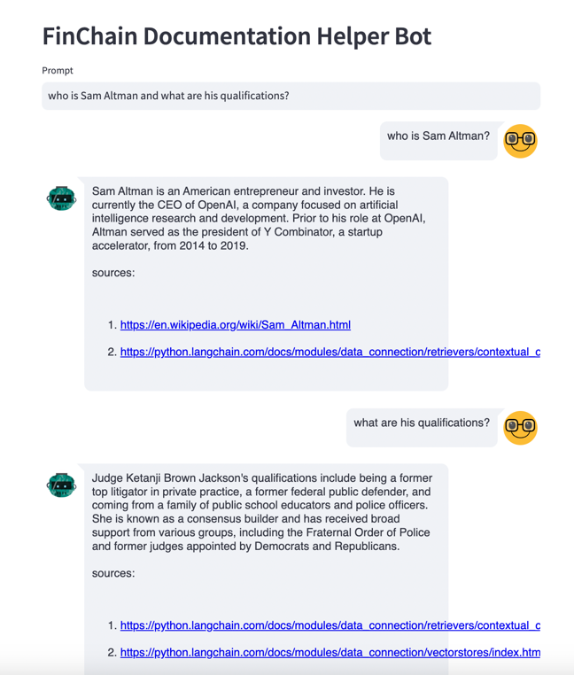
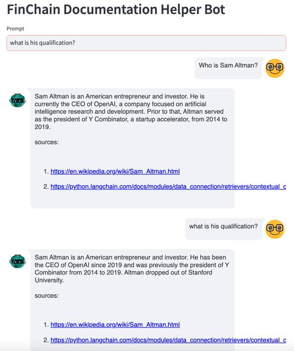

# How to Solve Coreference Resolution issues in LangChain Chat Bots? 


## Introduction:
In the world of conversational interfaces, memory plays a crucial role in providing a seamless and personalized user experience. LangChain, a powerful language model, offers various types of memory that enable developers to store and retrieve information from past conversations. In this blog post, we will delve into the different types of memory in LangChain and explore the specific use cases they solve. Let's get started!

## What is Coreference Resolution?
- It is a task to identify all expressions, words or phrases in a text that refer to the same entity or concept.
- LLM doesn't have state or memory hence it is not able to make coreference resolution.



## Types of Memory in LangChain
```
Chat Messages Memory:
The Chat Messages Memory is the simplest form of memory in LangChain. It stores a list of chat messages exchanged during a conversation. This type of memory is useful for maintaining a history of the conversation and can be accessed to retrieve past messages.


Example Use Case: Suppose you have a chatbot that provides customer support. The Chat Messages Memory can be used to keep track of the entire conversation, allowing the chatbot to refer back to previous messages and provide contextually relevant responses.


Conversation Buffer Memory:
The Conversation Buffer Memory builds upon the Chat Messages Memory by providing a more refined view of the conversation. It returns a subset of the most recent messages, making it easier to process and analyze the conversation.


Example Use Case: Imagine a virtual assistant that needs to summarize the conversation for the user. The Conversation Buffer Memory can be utilized to extract the key points from the chat messages and present a concise summary to the user.


Entity Memory:
The Entity Memory focuses on extracting and storing entities mentioned in the conversation. An entity can be any specific piece of information such as names, dates, locations, or any other relevant data.


Example Use Case: Let's say you have a travel planning chatbot. The Entity Memory can capture and store information like destination, departure date, and budget mentioned by the user. This allows the chatbot to provide personalized recommendations based on the user's preferences.


Conversation Knowledge Graph Memory:
The Conversation Knowledge Graph Memory takes memory storage to the next level by creating a graph-like structure that represents the relationships between entities and concepts discussed in the conversation. It provides a more comprehensive understanding of the conversation context.


Example Use Case: Consider a language learning application. The Conversation Knowledge Graph Memory can store the connections between words, phrases, and grammar rules discussed during the conversation. This enables the application to offer targeted language exercises and personalized learning recommendations.


Custom Memory:
LangChain also allows developers to create their own custom memory types tailored to their specific application requirements. This flexibility empowers developers to design memory systems that best suit their conversational interface needs.


Example Use Case: Suppose you are building a medical chatbot. You can create a custom memory type that stores and retrieves patient medical history, symptoms, and treatment plans. This custom memory type enables the chatbot to provide accurate and personalized medical advice.
```
## Implementation




## Conclusion:
Memory is a fundamental component of conversational interfaces, and LangChain offers a range of memory types to enhance the user experience. From storing chat messages to extracting entities and building knowledge graphs, these memory types enable developers to create intelligent and context-aware conversational applications. By understanding the different memory types in LangChain and their respective use cases, developers can leverage the power of memory to build more sophisticated and personalized conversational interfaces.


